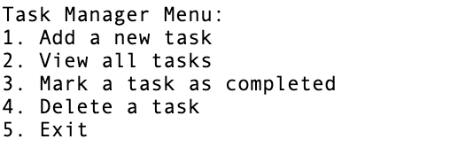

# Task Manager

Welcome to the Task Manager! This simple Python program helps you manage your tasks effectively. Follow the steps below to get started:

## Instructions
Follow these steps to build and use the Tasks Manager.

### Step 1 - Create new file:
Create `to_do_items_manager.py`

### Step 2 - Initialize an empty list to store tasks:
At the beginning of the code, create an empty list called `tasks`. 
This list will be used to store task information.

### Step 3 - Create a function to display the menu:
Define a function called `display_menu()` to print out the menu options for the Task Manager program. 
This function should be called inside the main loop to display the menu to the user.

### Step 4 - Create a function to add a new task:
Define a function called `add_task()` to allow the user to add a new task to the `tasks` list. 
It should prompt the user to enter a task description and then append a dictionary containing 
the description and a `completed` flag set to `False` to the tasks list.

### Step 5 - Create a function to view all tasks:
Define a function called `view_tasks()` to display all the tasks in the `tasks` list. 
It should iterate through the list and print each task's description along with its completion status.

### Step 6 - Create a function to mark a task as completed:
Define a function called `mark_completed()` to allow the user to mark a task as completed by specifying its index. 
It should prompt the user to enter the task number and then update the corresponding task's `completed` flag to `True`.

### Step 7 - Create a function to delete a task:
Define a function called `delete_task()` to allow the user to delete a task by specifying its index. 
It should prompt the user to enter the task number and then remove the task from the `tasks` list.

### Step 8 - Implement the main program loop:
Create a `while` loop that continuously displays the menu, takes user input for their choice, 
and executes the corresponding function based on the user's choice. 
The loop should continue until the user chooses to exit the program.

## Run the program
- Run the code inside a `to_do_items_manager.py` file.

## Main Menu

You will be presented with a main menu that offers various options:

**1. Add a New Task:**
   - Type `1` and press Enter to add a new task.
   - Follow the prompts to enter the task description.
   - The task will be added to your to-do list.

**2. View All Tasks:**
   - Type `2` and press Enter to view all your tasks.
   - You'll see a numbered list of tasks.
   - Tasks marked as completed will have "(Completed)" next to them.

**3. Mark a Task as Completed:**
   - Type `3` and press Enter to mark a task as completed.
   - Enter the task number when prompted.
   - The task will be updated to indicate that it is completed.

**4. Delete a Task:**
   - Type `4` and press Enter to delete a task.
   - Enter the task number when prompted.
   - The task will be removed from your to-do list, and you'll see a confirmation message.

**5. Exit:**
   - Type `5` and press Enter to exit the task manager.

